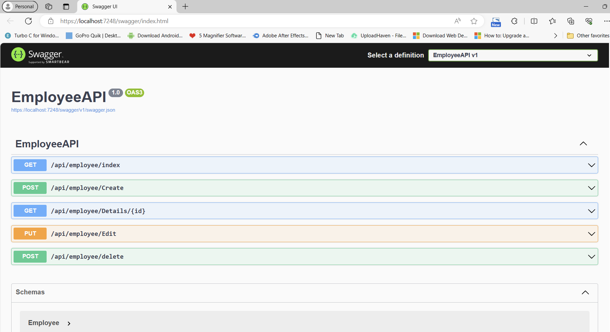

**EMPLOYEE CRUD APPLICATION**

Using Web API in ASP.NET Core, Angular CLI and SQL Server.

**OVERVIEW**


In the CRUD (Create, Read, Update, Delete) application, I have used Angular v17 for the front-end part and Microsoft Visual Studio 2022 for Backend Coding and SQL Server for Database Management. In this Application User can do below things:

- Look at a list of employees in a table.
- Add new employees by filling out a form with their first name, last name, email, and phone number.
- Edit the details of existing employees.
- Remove employees from the list if needed.

**Installation Steps for Angular**

*Note: I have used <https://radixweb.com/blog/how-to-install-angular-on-windows> for reference.*

1) The first step is to install Angular CLI with NPM. Hence, it’s required to install Node.js on your system.

   You can go to the official website of Node.js - <https://nodejs.org/en/download/current>, from where you can download the latest Node version.

1) Install TypeScript (Optional)

   TypeScript plays an important role in maintaining and understanding JavaScript. You can install TypeScript as an NPM package. However, this installation step is a completely optional part. It doesn’t cause you for Angular development.

    Go to Windows Command Prompt and install TypeScript with the below command:

    ` npm install -g typescript `

1) Install Angular CLI

	Now open Command Prompt/Powershell and install the Angular CLI.

    `npm install -g @angular/cli`

**Installation Steps for Visual Studio 2022**

1) Install Visual Studio 2022 from official site <https://visualstudio.microsoft.com/downloads/>
1) Simply follow steps and enter Next by reading instructions and Click on Finish.


**PROJECT IMPLEMENT**

1) **Table Creation.**

   Create table in SQL Server using SSMS.
   Below is SQL Table Queries.

   //Backup Table to stored delted Employee Records.

   //Backup Table to stored delted Employee Records.
   

CREATE TABLE backup_employeetable
  (
  
     [bck_emp_id] [INT] IDENTITY(1, 1) NOT NULL PRIMARY KEY,
     [firstname]  [VARCHAR](30) NULL,
     [lastname]   [VARCHAR](30) NULL,
     [email]      [VARCHAR](30) NULL,
     [mobileno]   [VARCHAR](15) NULL,
     [empid]      [INT] NULL
  )
  
//Main table to store Employee Records

CREATE TABLE employeetable
  (
  
     [empid]     [INT] IDENTITY(1, 1) NOT NULL PRIMARY KEY,
     [firstname] [VARCHAR](30) NULL,
     [lastname]  [VARCHAR](30) NULL,
     [email]     [VARCHAR](30) NULL,
     [mobileno]  [VARCHAR](15) NULL
  ) 


1) **Create WEB API in Microsoft Visual Studio using Entity framework.**
   1. Choose **ASP.NET Core Web API (C#)** for create new project.
   2. Directory structure will look like this:

      

   3. Install below NuGet package
      1. Microsoft.EntityFrameworkCore
      2. Microsoft.EntityFrameworkCore.SqlServer

   4. Create another Class Library in same project and set Project reference on Web API project to Class Library.
      1. Create two module class for Employee and Backup Record Employee. (Refer GitHub)

   5. Create Repository, Interface for Repository and DB Context Class. (Refer GitHub)
   6. Add Connection String in appsettings.json file. (Refer GitHub)

    ```json
        "ConnectionStrings": 
        {
         "con": "Data Source={instance name};Initial Catalog=[database name];Integrated         Security=True"
        }
    ```
    7. To implement certain changes in the `Program.cs` file, follow the steps below:

        1. **Configure CORS:**
        ```csharp
        // Configure CORS
        builder.Services.AddCors(options =>
        {
            options.AddPolicy("AllowAngularFrontend", builder =>
            {
                builder.WithOrigins("http://localhost:4200").AllowAnyHeader().AllowAnyMethod();
            });
        });
        ```

        2. **Add DbContext using SQL Server provider:**
        ```csharp
        // Add DbContext using SQL Server provider
        services.AddDbContext<EmployeeDbContext>(options =>
            options.UseSqlServer(builder.Configuration.GetConnectionString("con")));
        ```

        3. **Add scoped services:**
        ```csharp
        // Add scoped services
        services.AddScoped<IEmployee, EmployeeRepository>();
        ```

    • Ensure to apply these changes accordingly in your `Program.cs` file for the desired functionality.

    • Create API Controller and create API endpoints for get, insert and update records. (Refer GitHub)
    
    • Run Project to Check.

1) **Create Angular Project.**
   1. Open cmd and type beloe command to create new project

      `ng new EmployeeApp --no-standalone`

   2. Go to project dir using cd command and create component.

        `..Path/EmployeeApp>* *ng g c employeecrud`

        *//navbar component is optional*

        `..Path/EmployeeApp>ng g c navbar`
        
    3. Install Bootstrap

        `..Path/EmployeeApp>npm install bootstrap`

        • Open Project in vs code by using `code .` command
        
        • Directory Structure will look like this :

        


    4. Add Bootstrap link in Styles.css(Refer GitHub)
    5. Do changes in src/app/app.module.ts file. (Refer GitHub)
    6. Add component and necessary imports.
    7. Remove app.component.html content and add below code:

        ```
        <app-navbar></app-navbar>
        
        <app-employeecrud> </app-employeecrud>
        
        <router-outlet />
        ```
    8. Design your frontend in your component html file such as employeecrud.component.html (Refer GitHub)
    9. Call API in employeecrud.component.ts file. (Refer GitHub)
    10. Run Web API project in Visual Studio and Run Angular Project in VS code by giving below command in VS terminal or cmd.

        `ng serve`

*make sure about port after localhost when run WEB API Project.*


- **If you have everything installed than just clone repository and keep below points:**
  - SSMS: Run SQL Query
  - Visual Studio: Change Connection String
  - No changes in Angular Environment (According my system)


**SNAPSHOTS**




*[WEB API in Asp.Net Core]*


*[Angular]*


